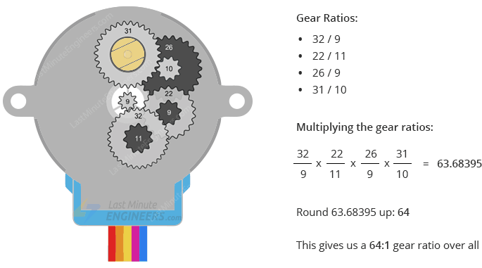

# 28BYJ48 
|tit|val|
|---|---|
|Operating Voltage|5VDC|
|Operating Current|240mA (typical)|
|Number of phases|4|
|Gear Reduction Ratio|64:1|
|Step Angle|5.625°/64|
|Frequency|100Hz|
|In-traction Torque|>34.3mN.m(120Hz)|
|Self-positioning Torque|>34.3mN.m|
|Friction torque|600-1200 gf.cm|
|Pull in torque|300 gf.cm|  

so required steps for one revolution of the main outside metal pen is what ? 
maybe 2048
2048 steps /  (64(:1) gear ratio) = 32

online some guys say it is 2038
....
